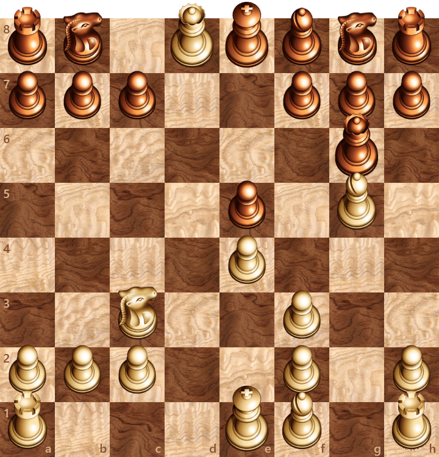
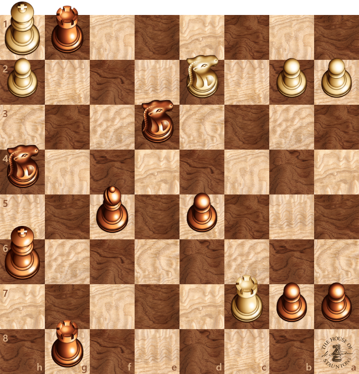
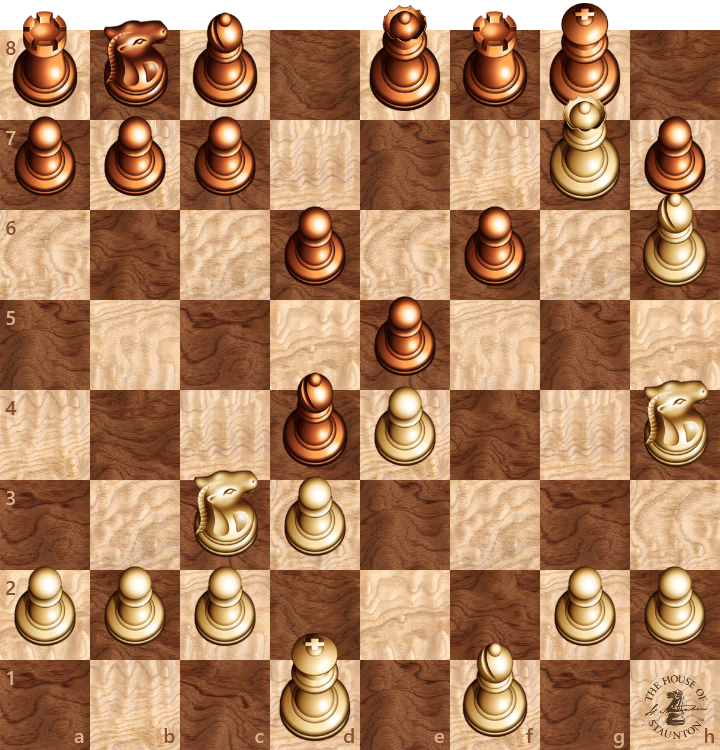

  

    <h2>Wanna know me?</h2>
     
    Curious mind. Terminal open. Limits questioned. 
Building apps, designing visuals, hacking knowledge, shipping progress.

 
<table>
  <tr>
    <td><h3>🛠 Tech Stack:</h3></td>
    <td><h3>💻 Environment:</h3></td>
  </tr>
  <tr>
    <td>
      &nbsp;
      &nbsp;
      &nbsp;
      &nbsp;
      &nbsp;
       
      &nbsp;
      &nbsp;
      &nbsp;
      &nbsp;
      &nbsp;
    </td>
    <td>
      &nbsp;
      &nbsp;
      &nbsp;
      &nbsp;
      &nbsp;
    </td>
  </tr>
</table>
 

<h2> U like reading?</h2>

Catch me up on medium:

 
 

<h2> Special cards:</h2>

  

<h2> Checkmate !</h2>
      
