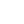

  

    <h3>✨Wanna know me?</h3>
     
    Curious mind. Terminal open. Limits questioned. 
Building apps, designing visuals, hacking knowledge, shipping progress.

 
<table>
  <tr>
    <td><h3>🛠 Tech Stack:</h3></td>
    <td><h3>💻 Environment:</h3></td>
  </tr>
  <tr>
    <td>
      &nbsp;
      &nbsp;
      &nbsp;
      &nbsp;
      &nbsp;
       
      &nbsp;
      &nbsp;
      &nbsp;
      &nbsp;
      &nbsp;
    </td>
    <td>
      &nbsp;
      &nbsp;
      &nbsp;
      &nbsp;
      &nbsp;
    </td>
  </tr>
</table>
 

<h3>⚡ Special cards:</h3>

  

  
  
  
  

